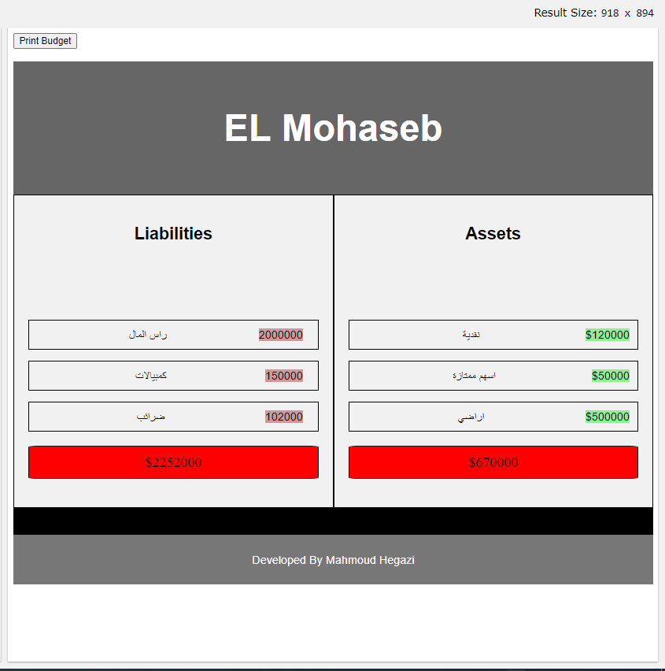
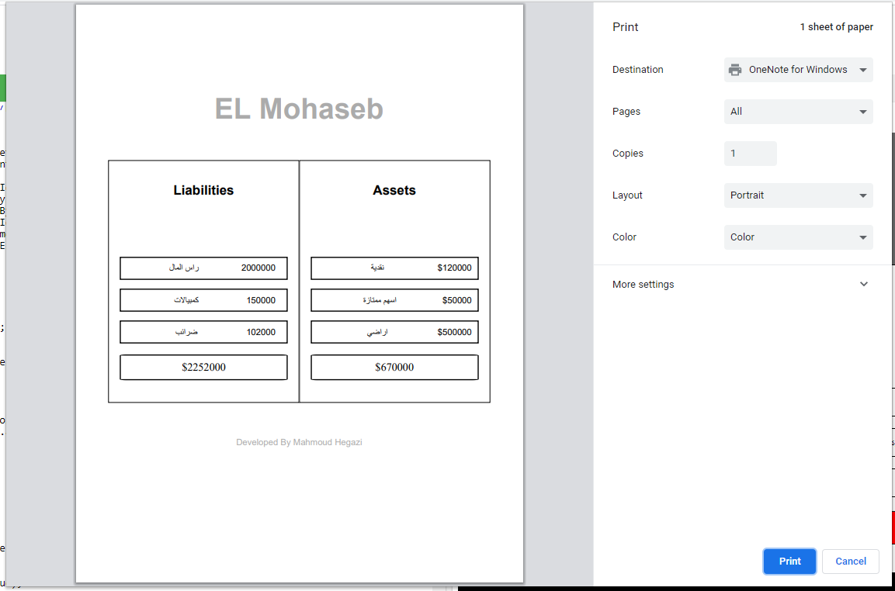
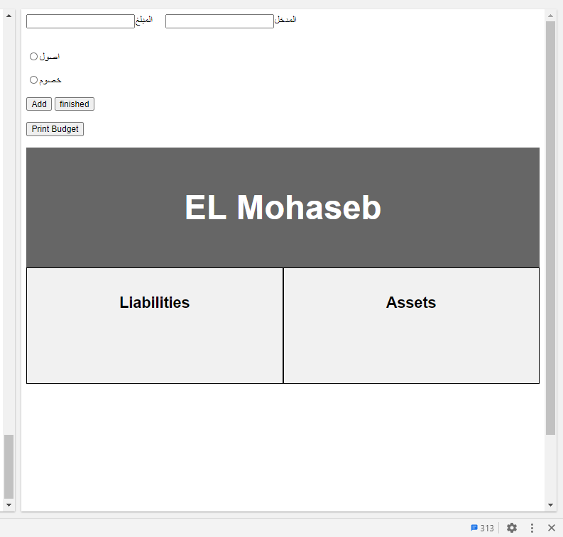
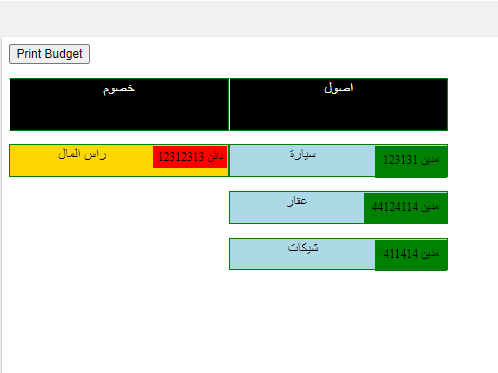

## (ElMohaseb Budget JS app openSource)
develop plan:
فكر في التسويق العب علي حتيت اليوزرس العادين ده لو المحاسبين عايزنه ومش هيخاف
ممكن المستخدم يحسب مزانية بيته ويحط خطه يحوش ولو دخلت البايثون ممكن اقدر
اسعده في الادخار بس ده قدام 
وسجل كمان الميزانيات اللي فاتت واقوله حوش ايه وزاد ولا لا 
يمكن جعل المستخدمين يقوم بعمل ميزانيات للمشروعات ووضعها علي المنتدي كمرجع
وامكانية طبعها والزيادة فيها او النقص
لدي كل مستخدم في قائمته

I deleted the part for add the total inside the div bymistake I will do again later 

try it for free: https://unweededfruit.htmlpasta.com/

Full code on this file Elmohaseb.html 

add items and enter the number then select the type of each item click finish get prinited budget
    (MIX web development and accounting)

One of my dreams while I was at my academy studing accounting is to build an application

can create the budget  and Now I did it (JS pure) (not for kids)

next :
make the highr total be green
don't forget to add: اجمالي في النحتين وترحيل الفرق
performance 

	
	

	
	

(1day project) (old version)
### solved with new interface (the style problem )
(first_version)

recap:
في الأساس، الميزانية هي مفهوم الاقتصاد الجزئي الذي يظهر المقايضة عندما يتم تبادل واحد جيد لآخر. من حيث النتيجة النهائية - النتيجة النهائية لهذه المقايضة - الميزانية الفائضة تعني الأرباح المتوقعة، وميزانية متوازنة تعني أن الإيرادات من المتوقع أن تساوي النفقات، وميزانية العجز يعني أن النفقات سوف تتجاوز الإيرادات.
