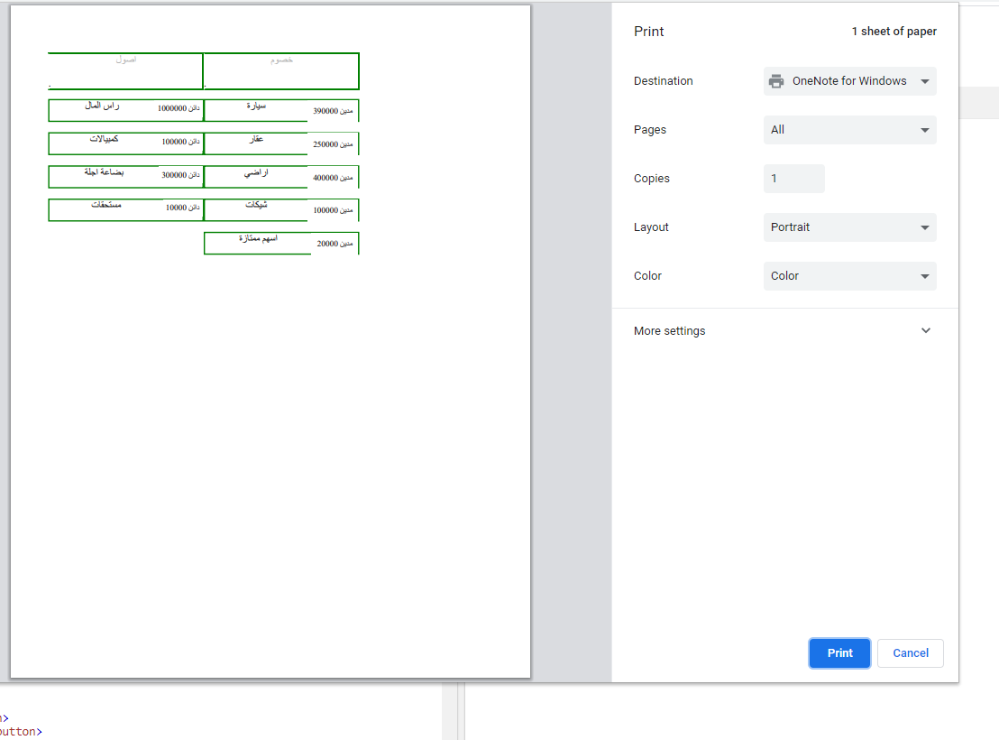

Full code on this file Elmohaseb.html 

add items and enter the number then select the type of each item click finish get prinited budget
    (MIX web development and accounting)

One of my dreams while I was at my academy studing accounting is to build an application

can create the budget  and Now I did it (JS pure) (not for kids)

next :
don't forget to add: اجمالي في النحتين وترحيل الفرق
performance 

(1day project)

### maybe python and jinja2 make it more professoinal

### solved with new interface (the style problem )

recap:
في الأساس، الميزانية هي مفهوم الاقتصاد الجزئي الذي يظهر المقايضة عندما يتم تبادل واحد جيد لآخر. من حيث النتيجة النهائية - النتيجة النهائية لهذه المقايضة - الميزانية الفائضة تعني الأرباح المتوقعة، وميزانية متوازنة تعني أن الإيرادات من المتوقع أن تساوي النفقات، وميزانية العجز يعني أن النفقات سوف تتجاوز الإيرادات.
